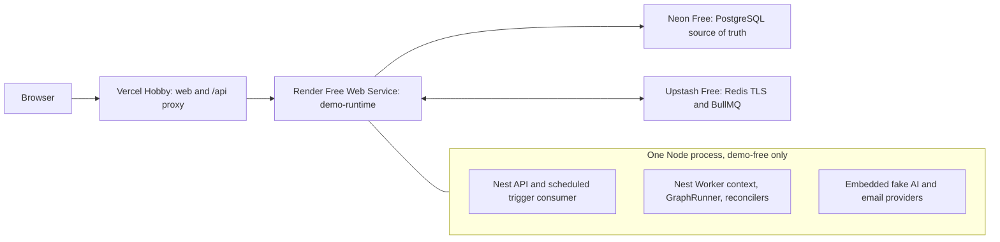

# Deploying the FlowMind portfolio demo for USD 0/month

## Architecture



`demo-runtime` creates two independent Nest contexts and owns the only signal
handlers. Readiness is 200 only after PostgreSQL, Redis, both BullMQ processors,
the execution and notification reconcilers, and the event dispatcher are up.
Shutdown first flips readiness to draining, then gives consumers up to 20
seconds to pause and close. Render is configured with a 30-second maximum
shutdown delay.

## Provider decision and free-tier budget

Render Hobby with one Free Web Service is the selected container provider. It
supports a repository Dockerfile, a public HTTPS origin, secrets, and outbound
TCP connections without requiring a payment method. Keep the workspace without
a payment method so a quota overrun suspends the service instead of charging.

Current limits relevant to this profile are:

- 512 MiB RAM and 0.1 CPU for the Free instance;
- 750 Free instance hours per workspace and calendar month;
- spin-down after 15 minutes without inbound HTTP traffic; actual cold-wake
  latency must be measured on Render after deployment;
- one instance, ephemeral filesystem, no persistent disk, SSH, or one-off jobs;
- 500 build pipeline minutes and 5 GB outbound bandwidth per month on Hobby;
- no SLA or high availability.

See the current Render documentation for
[Free services](https://render.com/docs/free),
[compute plans](https://render.com/docs/compute-plans),
[workspace plans](https://render.com/docs/new-workspace-plans),
[build minutes](https://render.com/docs/build-pipeline), and
[bandwidth](https://render.com/docs/outbound-bandwidth).

Alternatives were rejected for this profile:

| Provider                                                                         | Current constraint                                                                                                                                 |
| -------------------------------------------------------------------------------- | -------------------------------------------------------------------------------------------------------------------------------------------------- |
| [Railway](https://docs.railway.com/pricing/plans)                                | The post-trial Free plan provides USD 1/month; continuous 300-430 MiB RAM exceeds it, and Redis/BullMQ traffic prevents reliable serverless sleep. |
| [Northflank](https://northflank.com/pricing)                                     | Its Sandbox requires a payment method before resource creation and does not publish enough Free-container memory detail to approve this runtime.   |
| [Fly.io](https://fly.io/docs/about/free-trial/)                                  | The current offer is a short trial, not a sustainable free tier.                                                                                   |
| [Zeabur](https://zeabur.com/en-US/pricing)                                       | Free manages a self-owned server; hosted compute is paid after trial.                                                                              |
| [Hugging Face Docker Spaces](https://huggingface.co/docs/hub/spaces-sdks-docker) | Free Docker egress does not allow the PostgreSQL and Redis TCP ports required by this runtime.                                                     |
| [Cloud Run](https://docs.cloud.google.com/run/docs/configuring/billing-settings) | Billing is required and request-based CPU does not fit the continuously running worker.                                                            |

The expected total is USD 0/month only while the portfolio remains eligible
for [Vercel Hobby](https://vercel.com/docs/plans) as a personal,
non-commercial project and usage remains inside:

- Neon Free: 100 CU-hours and 0.5 GB storage per project;
- Upstash Redis Free: 256 MB data, 500,000 commands, and 10 GB bandwidth per
  month.

See the current [Neon](https://neon.com/pricing) and
[Upstash Redis](https://upstash.com/pricing/redis) pricing pages before
provisioning. Do not add a paid domain, plan upgrade, or additional Render
service to this profile.

### Redis scale-to-zero operating budget

Do not extrapolate idle BullMQ consumption to 24 hours per day. Render stops
the process after 15 minutes without inbound traffic, so BullMQ polling,
reconcilers, and the dispatcher stop with it. For one portfolio session use:

```text
awakeWindowCommands = 113.6 commands/minute × 15 minutes = 1,704
journeyCommands = max(previous 576, coherent rehearsal average 607) = 607
base session = 1,704 + 607 = 2,311 commands
25% contingency = startup/recovery + extra navigation + occasional retries
operational session budget = round up to 3,000 commands
```

The 25% contingency produces 2,889 commands before rounding. Keep a separate
20% monthly reserve by treating 400,000 commands as the operating ceiling
inside the hard 500,000-command Free quota.

| Sessions/day | Commands/month | Margin to 500k | Quota | Operating decision                          |
| ------------ | -------------- | -------------- | ----- | ------------------------------------------- |
| 1            | 90,000         | 410,000        | 18%   | within budget                               |
| 3            | 270,000        | 230,000        | 54%   | recommended maximum                         |
| 5            | 450,000        | 50,000         | 90%   | hard quota only; not operationally approved |
| 7            | 630,000        | -130,000       | 126%  | over quota                                  |
| 10           | 900,000        | -400,000       | 180%  | over quota                                  |

Three sessions per day is the conservative portfolio limit. Five per day is
mathematically below 500,000 but leaves too little room for variance and is not
approved as the normal operating pattern.

## Preserved behavior and deliberate limits

The demo keeps BullMQ, PostgreSQL leases, `runAttempt`, GraphRunner, Graph v2,
approvals, replay, Run History, event triggers, notification materialization,
idempotency, durable delays, and all reconcilers. It does not replace execution
with serverless handlers.

Render Free sleeps based on inbound HTTP inactivity. During sleep no timer or
consumer runs. Waiting and delayed jobs remain in Redis, while PostgreSQL
remains the source of truth for queued, retrying, expired-lease, approval,
event, and notification recovery. Work resumes after the next request wakes the
service. Schedules and deadlines are therefore best-effort, not real-time.
Public registration is disabled; AI and physical email delivery are simulated
and clearly labeled.

Use one execution consumer and curated flows: at most 20 steps, 25 `FOR_EACH`
items, and external steps under 30 seconds. The product engine retains its
production limits; these are portfolio operating limits for 512 MiB.

## Manual provisioning

This repository does not contain a Render Blueprint and never creates or
reconfigures remote resources. Provision resources manually:

1. Confirm the existing Neon project is Free and obtain its direct connection
   string without modifying data.
2. Confirm the existing Upstash database is Free, uses TLS, and has eviction
   disabled.
3. Create a Render Hobby workspace through GitHub OAuth without adding a
   payment method.
4. Create one Free Web Service from the reviewed repository with:
   - repository root left blank;
   - Docker runtime;
   - Dockerfile `infrastructure/docker/Dockerfile.demo-free`;
   - Docker context `.`;
   - one instance in the region nearest the existing Neon and Upstash services;
   - auto-deploy and pull request previews disabled;
   - health check `/health/ready`;
   - shutdown delay 30 seconds;
   - no disk or pre-deploy command;
   - `PORT=3001`.
5. Use the validated regional topology: Render Ohio, Neon
   `aws-us-east-2`, and Upstash `us-east-2`. This keeps all stateful traffic in
   the same AWS region without leaving any Free tier.
6. For the unavoidable initial Render deploy, set only
   `FLOWMIND_DEPLOYMENT_PROFILE=provisioning`. The image builds, but the launcher
   exits before initializing PostgreSQL or Redis. Afterwards use **Save only**
   to replace it with the complete `demo-free` runtime environment; do not
   redeploy yet.
7. Create a Render API key for operator automation and record the `srv-...`
   service ID and public `onrender.com` origin. Never add `RENDER_API_KEY` to
   the service environment.
8. Keep the Vercel Hobby project rooted at `apps/web`. Configure the production
   environment through the dashboard or CLI without committing `.vercel`.

Install and authenticate the operator CLIs:

```bash
curl -fsSL \
  https://raw.githubusercontent.com/render-oss/cli/refs/heads/main/bin/install.sh |
  sh
render login
render workspace set

pnpm install --global vercel
vercel login
```

Use
[`infrastructure/managed/demo-free.env.example`](../infrastructure/managed/demo-free.env.example)
as the split runtime/operator checklist. Store real values outside the
repository. Local gates use one persistent credential file:

```bash
install -d -m 700 ~/.config/flowmind
umask 077
"${EDITOR:?Set EDITOR first}" ~/.config/flowmind/demo-free.env
chmod 600 ~/.config/flowmind/demo-free.env
```

It must contain exactly the pooled Neon and TLS Upstash URLs:

```dotenv
DATABASE_URL=<Neon pooled URL with sslmode=require&connect_timeout=15&connection_limit=3>
REDIS_URL=<Upstash rediss:// URL>
```

Keep this file outside the repository. The gates reject symlinks, a different
owner, permissions other than `600`, extra keys, a non-pooled Neon endpoint,
missing Neon TLS parameters, or a non-`rediss://` Redis URL. They never source
the file or read `.env.local`; inherited `DATABASE_URL` and `REDIS_URL` values
are removed. Credentials are supplied in memory only to the process that needs
them, and output is redacted defensively. The file remains in place after every
gate and is never copied into the worktree.

## Build, memory, and migration gates

Build the exact candidate:

```bash
bash -n scripts/deploy/demo-free.sh
corepack pnpm --filter @automation/demo-runtime... build
corepack pnpm --filter @automation/demo-runtime typecheck
docker build \
  -f infrastructure/docker/Dockerfile.demo-free \
  -t flowmind-demo-free:memory .
```

Before deployment, exercise shutdown and restart against the intended data
services, run the real-Redis reconciler integration test, and sample a
representative curated workflow for 30 minutes:

```bash
pnpm deploy:demo-free:runtime-gate
```

The harness creates `METRICS_API_KEY`, application secrets, and the demo
password independently in memory for each run. Those values remain ephemeral.
It does not create remote resources. Any `/tmp` state needed by an isolated
tooling test is created and removed automatically; operators do not manage
temporary credential files.

The gate is idle RSS at or below 300 MiB, representative peak below 400 MiB,
no sample above 430 MiB, readiness in under 90 seconds, and no BullMQ stalled
events. If it fails, Render Free is not viable for this combined image. Do not
remove the Worker or change GraphRunner/Graph v2 to force it to fit.

### Local gate record — 2026-07-24

The exact 30-minute gate used real pooled Neon, real TLS Upstash,
`demo-runtime`, embedded fake AI, and embedded fake email. A sequential full
journey started every three minutes while RSS sampling ran independently:

| Measurement           | Result                                                                       |
| --------------------- | ---------------------------------------------------------------------------- |
| Duration / cadence    | 1,800 seconds; 61 samples; 30 seconds; maximum lateness 0.008 seconds        |
| Journeys              | 10                                                                           |
| RSS initial / minimum | 126 / 100 MiB                                                                |
| RSS average / p95     | 129.46 / 135 MiB                                                             |
| RSS peak / final      | 135 / 109 MiB                                                                |
| Trend                 | -29.44 MiB/hour regression; late GC; stable/decreasing, not monotonic growth |
| OOM / restarts        | none                                                                         |
| Average CPU           | 2.04% local                                                                  |
| Margin to 512 MiB     | 377 MiB at peak                                                              |

An earlier same-day stress pass kept 15 full journeys running as fast as they
could complete. Its RSS was 170 MiB initial, 177.28 MiB average, 180 MiB p95
and peak, and 175 MiB final, also with no OOM or restart. Its sampler was
blocked by each awaited journey, so it is supporting stress evidence and not
the cadence-compliant memory gate.

The coherent Upstash counter from that stress pass was 4,948 initially and
14,084 finally: delta 9,136 over 2,360 seconds, 232.28 commands/minute under
continuous heavy load, and 606.93 commands per full journey averaged across 15
journeys. The standalone initial journey used 586 commands. Compared with the
previous measurements, this is +30.93 commands/journey (+5.4%) against the
576-command baseline, while the standalone journey is +10 (+1.7%).

During the cadence-compliant pass, Upstash returned a static
`total_commands_processed=170` despite ten proven journeys; a post-gate probe
then returned 22,267 but did not advance across five PINGs. Treat `INFO stats`
as an intermittently cached/reset provider counter, not as authoritative quota
telemetry. The zero delta from that pass is invalid and is not used to reduce
the budget. Use 607 commands/journey for planning and verify the monthly total
in the Upstash console after deployment.

For the scale-to-zero lifecycle, two same-day 120-second observations showed
zero material command growth after stopping `demo-runtime` and closing the
harness Queue/QueueEvents connections. A durable `QUEUED` execution created
only in Neon was recovered after restart by the reconciler, ran once
(`runAttempt=1`, six unique steps), and reached `COMPLETED`. The cadence gate's
local restart reached readiness in 12.09 seconds and recovery completed in
48.501 seconds. These are local references only, not Render cold-start
estimates. Actual Render cold-start timing remains a post-deployment
measurement.

The real Redis-outage rehearsal remains unperformed because Upstash Free does
not expose the administrative controls needed to induce it. This is a known
test limitation, not a local deployment blocker; restart recovery is the
substitute rehearsal.

For technical gates on the current working tree, run:

```bash
pnpm deploy:demo-free:validate
```

Validation mode accepts a dirty worktree, prints an
`uncommitted:<working-tree-fingerprint>` identity, and never contacts Render or
Vercel and never deploys. Record that identity with memory and recovery
evidence. Do not set `FLOWMIND_MEMORY_GATE_APPROVED_SHA` for an uncommitted
working tree. It reads the pooled Neon and Upstash credentials from the
persistent local file and leaves that file untouched.

Only after the same validated state has become an exact reviewed, clean commit,
bind the evidence to that SHA and enter deployment mode:

```bash
export FLOWMIND_MEMORY_GATE_APPROVED_SHA="$(git rev-parse HEAD)"
pnpm deploy:demo-free:plan
pnpm deploy:demo-free:preflight
```

Deployment preflight requires exactly 26 migrations and clean migration
history through the pooled Neon/TLS URL, a TLS-only Upstash URL, explicit
Free/Hobby assertions, a clean reviewed SHA equal to
`FLOWMIND_DEPLOY_GIT_SHA`, memory evidence approved for that SHA, working
provider CLIs, and an image below 1.5 GiB. It reads the existing Render service
configuration without reading its environment variables and verifies the Free
plan, Docker paths, region, URL, one instance, disabled auto-deploy/previews,
health check, shutdown delay, and absence of a disk or pre-deploy command.
Vercel does not expose the account plan through this CLI flow, so
`FLOWMIND_VERCEL_PLAN=hobby` remains an operator assertion checked in the
dashboard.

## Controlled deployment

After reviewing the plan, export the explicit second gate:

```bash
export FLOWMIND_SECOND_GATE_APPROVED=DEPLOY_FLOWMIND_DEMO_FREE
pnpm deploy:demo-free:apply
```

Apply runs `prisma migrate deploy`, verifies migration history, runs the
idempotent demo seed, deploys the exact Git SHA to the existing Render service
and waits for the result, then deploys the Vercel project. It does not create
Neon, Upstash, Render, or Vercel resources.

Check both the container and first-party proxy. The retries allow for a cold
wake:

```bash
curl --retry 8 --retry-delay 10 --fail \
  "$FLOWMIND_API_ORIGIN/health/ready"

curl --retry 8 --retry-delay 10 --fail \
  "https://replace-me.vercel.app/api/health/ready"
```

## Portfolio acceptance and operations

The demo is publishable when a cold visit reaches login within 90 seconds and:

- refresh uses a first-party Secure/HttpOnly/SameSite=Lax `/api/auth` cookie;
- the seeded Graph v2 workflow runs Transform, an `if` branch, and fake AI;
- Run History exposes steps, attempts, inputs, and outputs;
- the seeded approval workflow resumes after approve/reject;
- an internal event triggers a workflow and a notification reaches fake
  delivery status `SENT`;
- replay creates a traced new execution;
- a wait that expires while asleep and an abandoned lease recover after wake;
- two briefly overlapping runtimes do not run two logical GraphRunners;
- production API still does not start a Worker and production Worker starts
  independently;
- usage remains below 80% of every free-tier allowance.

## Keep-alive exclusion for DEMO_FREE_PROFILE

The local profile audit found no demo-specific uptime pinger, HTTP cron,
external health poller, remote Prometheus scraper, scheduled self-ping,
persistent WebSocket, Vercel Cron, or scheduled GitHub Actions workflow.
`apps/web/vercel.json` has no `crons`, GitHub Actions run only on push/pull
request or manual dispatch, and demo metrics remain disabled with
`METRICS_ENABLED=false`.

Product scheduled triggers and internal polling are preserved. They run inside
the process and do not create inbound HTTP traffic, so they cannot wake Render
or prevent its inbound-idle spin-down. The staging Prometheus and production
rehearsal scripts are separate infrastructure and must not target the demo.
The Render platform health-check path is allowed, but no external service may
poll it. Do not add keep-alive, uptime, monitoring, WebSocket, cron, or weekly
automation to DEMO_FREE_PROFILE; any maintenance wake must be manual.

After acceptance, leave the service idle for more than 15 minutes and repeat
the smoke test to verify cold-start recovery. During the first month monitor
Render memory/OOMs, restarts, readiness, instance hours, build minutes and
bandwidth; Neon compute/storage; and Upstash commands/storage/bandwidth.

BullMQ polling consumes Upstash commands even at low portfolio traffic. Upstash
can archive an inactive Free database after at least 14 days, so perform one
manual wake/health check at least weekly. Do not add an uptime pinger as part of
the minimum deployment. The UI and portfolio copy must state that cold starts
and background suspension are expected and that AI/email are simulated.
